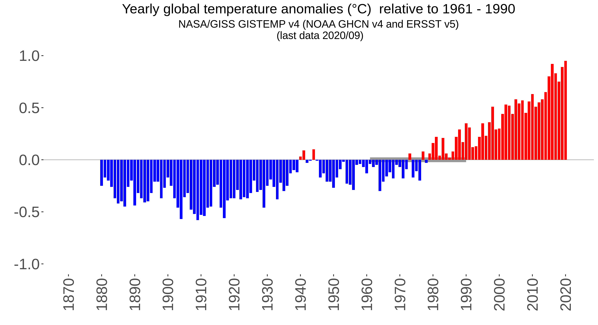
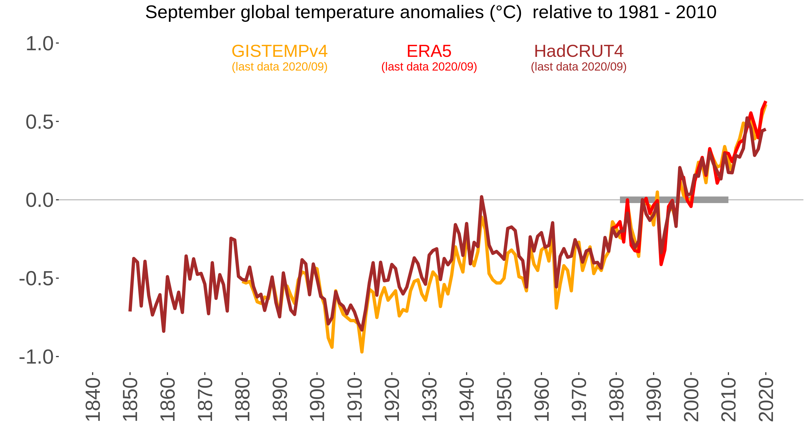

# globtemp.R
Function for plotting updated monthly or yearly global temperature anomalies from NASA/GISS [GISTEMPv4](https://data.giss.nasa.gov/gistemp), Copernicus [ERA5](https://climate.copernicus.eu/climate-bulletins), and/or Met Office Hadley Centre [HadCRUT4](https://www.metoffice.gov.uk/hadobs/hadcrut4), relative to a desired reference period.

## Prerequisites
R packages ggplot2 and lubridate (included in tidyverse)

## Supporting functions
* read_era5.R, read_hadcrut4.R, and read_nasa.R: functions for reading the most resent data from Copernicus/HadCRUT/NASA, respectively.
* anom2anom.R: function for changing the reference period for timeseries of anomalies.
* distr_col.R: function for distribution of colors blue/red/black for anomalies under/over/equal to desired reference period.
* plot_singular_points.R, plot_singular_bars.R, plot_plural_lines.R: functions for plotting
* top5.R: function for printing the top 5 years with the highest temperatures

## User input
Dataset(s) to plot, start and end of desired reference period, period of the year (e.g. 'Yearly', or 'January', or 'February',...), plotting type ('bars' or 'points') and option (TRUE/FALSE) to save plot as .png
The plotting type is only needed if one single dataset is used as input. Several datasets are always presented as solid lines.

## Examples R
```
globtemp(c('NASA'), 1961, 1990, 'Yearly', 'points', save_option = FALSE, save_name = NA)
```


```
globtemp(c('NASA'), 1961, 1990, 'Yearly', 'bars', save_option = FALSE, save_name = NA)
```


```
globtemp(c('NASA','Copernicus','HadCRUT'), 1981, 2010, 'September', save_option = TRUE, save_name = "example.png")
```


## Contact

Email: Line Båserud (lineb@met.no)
